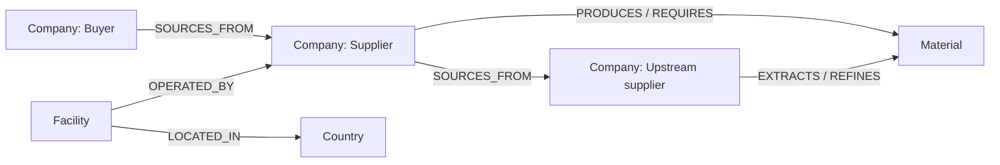

# Supplier Risk Graph

Supplier Risk Graph is a graph-powered resilience explorer for procurement teams. It makes hidden dependency paths visible: from a buyer, through direct suppliers, to upstream material producers and the facilities and countries that expose the chain to disruption.

## Why a graph database?

Supply-chain risk is primarily a connections problem. A relational model can store supplier rows, but answering *which critical upstream suppliers are two or three hops below a buyer, what materials join those paths, and which independent substitute producers exist?* requires repeated joins whose shape changes with each question. In CognoDB, the model maps directly to the domain and variable-length Cypher traversals make the dependency path first-class.

## Graph model



`SOURCES_FROM` carries `annualSpend` and `critical`; `Facility` carries a resilience `score`; countries have an overall `risk` level. IDs are constrained as unique and all application Cypher uses parameters.

## Main graph queries

1. **Multi-hop exposure:** `(:Company {id:$buyerId})-[:SOURCES_FROM*2..3]->(:Company)` traces second- and third-tier dependency paths, then joins facilities, countries and materials. This powers the risk cards.
2. **Substitution discovery:** starting with a buyer's primary producer, follow a shared `Material` node to another producer, then inspect its location and score. It finds alternatives based on the network rather than a hand-maintained supplier list.

## Run locally

Prerequisites: Node.js 18+ and a free CognoDB Cloud instance.

```bash
npm install
copy .env.example .env
# add the URI and password from CognoDB to .env
npm run seed
npm start
```

Open `http://localhost:3000`. Without `.env`, the dashboard runs with the same realistic demo dataset, making it easy to evaluate the UI; with credentials it reads live data from CognoDB. Secrets are never committed.

### Create the CognoDB instance

1. Sign up at `https://console.cognodb.com/signup`.
2. Create a free c0 instance and save the one-time password.
3. Put its `bolt+s://...` URI and the `cognodb` username in `.env`.
4. Run `npm run seed`.

## Architecture and failure handling

The browser is intentionally dependency-free. A small Node HTTP service owns connection configuration, uses the official `neo4j-driver` over Bolt, and exposes read-only JSON endpoints. If CognoDB is unreachable, each API response returns a clear `503` and the UI shows an actionable error rather than failing silently. `scripts/seed.js` loads idempotent Cypher from `data/seed.cypher`.

## Submission checklist

- [ ] Add a current dashboard screenshot to this README after running against the live instance.
- [ ] Deploy to a free Node-compatible host and add the hosted URL here.
- [ ] Record a 1-2 minute walkthrough: open the dashboard, explain a two-hop risk path, and explain an alternate supplier.
- [ ] Create a private GitHub repository, grant Wexa access if needed, and email the URL to `hr@wexa.ai`.
